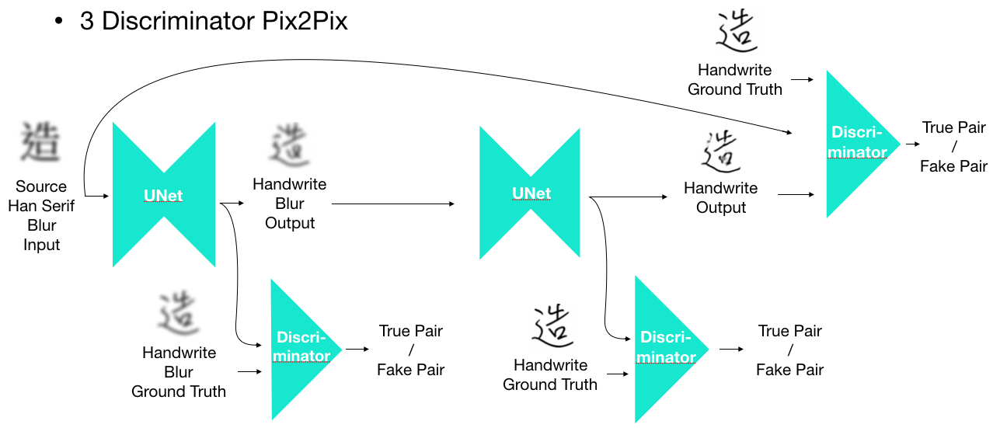

# cascaded-pix2pix---Chinese-handwriting-generator-
 

 We proposed a Chinese handwriting generator via cascaded-pix2pix to generate the handwriting with specific style. Our model takes the font charectar image as input and generate the handwriting iamge as output. In our experiment, we use 1000 differnet charectars in train_list.txt with source Han Serif(思源宋體) and handwriting to train our model. With the trained model, we can generate the unseen charactars very well.  

 In the origin pix2pix, it foucs on the image-to-image translation which the image pair are usually in the same position and structure. However, for handwriting generation, the font charectars and handwriting may vary a lot. Therefore, the result was not very good.

 We proposed the innovative cascaded pix2pix try to imporve the performance of generation. We use the blurred images as input ato make the position and structure be easiler to learn in the first pix2pix. After training for 100 epochs, we add another pix2pix to make blur handwriting to clear handwriting, and train the cascded pix2pix together to make sure the training procedure stable. Besides, we use the spectral normalization to constraint the Lipschitz constant to make it more stable.

 * pix2pix_2d: cascaded pix2pix  
 

 * pix2pix_3d: cascaded pix2pix  
 

